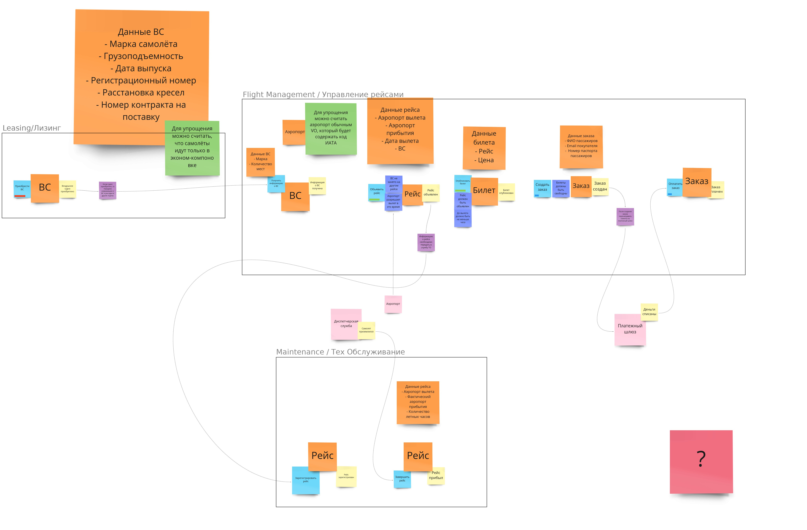

## Airline Enterprise Application
**Created during the course "Development Enterprise Applications"**

---
## Business introduction
###Event Storming


## Modules descriptions
It is multimodule project.

- Business modules
  - flightManagement - manage flight and tickets.
  - leasing - buy new Aircraft.
  - maintenance - support and maintenance of aircraft.
- integration - Integration with external services/APIs.
- common - module with common packages for other modules.
- mainapp - It was saved as an example of the app deployment.

## Project architecture
The project uses "DDD" approach and based on "Screaming" "Clean Architecture". 
Each module is a separated Bounded context having been split by "Clean Architecture" layers: Domain, Use Case.

_Layers "Interface Adapters" and "Frameworks and drivers" haven't been implement or not fully implemented yet._  

## Project workflow

The project is based on Trunk based development.  

## Initial setup
- run initialSetup.sh

## CI / CD

The project is hosted by AWS. Each New tag raises deployment to production.

During the build next plugins Analyze the code

- Checkstyle - Checks Google Code Style with customizations
- Owasp dependency check - Searches vulnerable dependencies
- pmd - Static code analyzer
- Gradle Version Plugin  - Checks does a new version of the dependencies exists.
- Jococo - minimum test coverage is 50% for now 

General plugins are placed here buildSrc/src/main/kotlin/airport.java-common-conventions.gradle.kts

###Run a new Production deployment
For the deployment we use Gradle Plugin https://github.com/researchgate/gradle-release. 

Switch to master branch and run next command.
```bash
./gradlew :release
```

Steps of the deployment:

- Create a new tag
- Push to github
- Github runs deployment to prod
- Build the project with all Analyzers 
- Build image and push to ECR mainapp  (scripts buildImage.sh and then pushImages.sh)
- AWS ECS runs deployment for the cluster airport. 

## Code design
### Error Handing / Raising
Modules **leasing** and **flightManagement** based on Domain Exceptions.

Module maintenance based on Vavr Either BusinessError or UseCaseError.

__It was made to compare 2 approached of error handling.__

## Helpers 

#### Show the list of the update candidate dependencies
The task: dependencyUpdates
The task runs as a dependency for :check command, as the result it runs every build as well.

To check common gradle plugin dependencies run the script checkAllDependencies.sh.  

#### Checkstyle of the code
The tasks: checkstyleMain and checkstyleTest

#### Run PMD static analyzer
The tasks: pmdMain and pdmTest

#### Check OWASP
The task: dependencyCheckAnalyze 